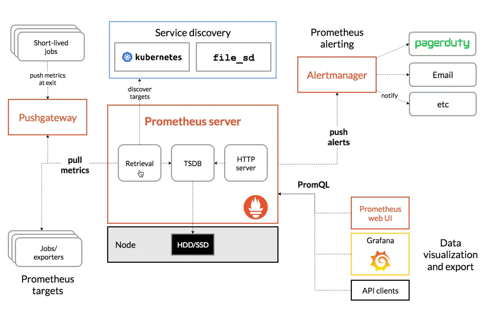
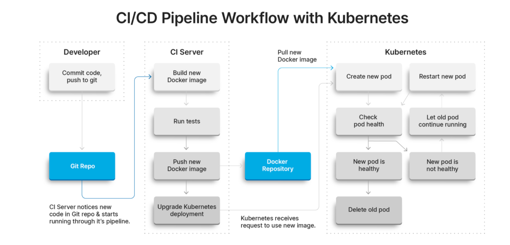
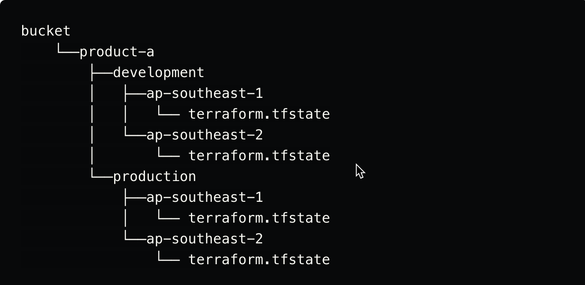

### Running Flask and Postgres on Kubernetes

~~Making a Flask app using a Postgresql database and deploying to Minikube~~

#### Prereq's
1. docker
2. docker-compose
3. minikube

### Tools Used
1. docker & docker-compose
2. Python Flask
3. Postgres
4. Minikube - To deploy apps in K8s

### Docker (Test the application locally)

Build the images and spin up the containers:

```sh
git clone https://github.com/Nagendran2807/flask_db_monitoring_k8s.git
cd flask_with_postgres
docker-compose up --build
```

### CRUD operation done 
1. Create New Team (CREATE)
2. Get the Team details (READ)
3. Edit existing Team (UPDATE)
4. Delete the team (DELETE)


1. [http://localhost:5020](http://localhost:5020)
2. [http://localhost:5020/hello](http://localhost:5020/hello)
3. [http://localhost:5020:hello/DevOpsGuy](http://localhost:5020/hello/DevOpsGuy)

You can put any name after /hello 
ex: [http://localhost:5020:hello/<Yourname>](http://localhost:5020/hello/<Yourname>)

If taking time to comeup, please refresh the page

Note:
-------
TeamName & players box support string

### Kubernetes

#### Minikube

Install and run [Minikube](https://kubernetes.io/docs/setup/minikube/):

1. Install a [Hypervisor](https://kubernetes.io/docs/tasks/tools/install-minikube/#install-a-hypervisor) (like [VirtualBox](https://www.virtualbox.org/wiki/Downloads) or [HyperKit](https://github.com/moby/hyperkit)) to manage virtual machines
1. Install and Set Up [kubectl](https://kubernetes.io/docs/tasks/tools/install-kubectl/) to deploy and manage apps on Kubernetes
1. Install [Minikube](https://github.com/kubernetes/minikube/releases)

Start the cluster:

```sh
$ minikube start --memory=4096 --cpus 4 --driver=hyperkit
$ minikube dashboard
```

#### Volume

Create the volume, Volume Claim & Secret 

```sh
kubectl apply -f ./kubernetes/postgres/postgres_storage_config.yml
```

#### Postgres

Create deployment & Service 

```sh
kubectl apply -f ./kubernetes/postgres/postgres.yml
```

Create the database:

```sh
kubectl get pods

pod_name=$(kubectl get po -l db=postgres -o jsonpath="{.items[0].metadata.name}")

kubectl exec -it $pod_name -it -- createdb -U postgres demo_db

kubectl exec -it $pod_name -i -- psql -U postgres <<EOF
ALTER USER postgres WITH PASSWORD 'admin123';
EOF
```

#### Flask

Build and push the image to Docker Hub:

```sh
$ docker build -t <hub-user>/<repo-name>[:<tag>] ./services/flask
$ docker push <hub-user>/<repo-name>[:<tag>]

$ docker build -t crazy28/flask-kubernetes:1.0 ./services/flask
$ docker push crazy28/flask-kubernetes:1.0
```
Note: I pushed the image to my dockerhub a/c and make it as public... so you can ignore this one 

Create the deployment & service :

```sh
kubectl apply -f ./kubernetes/flask/flask.yml
```

--------------------------------------------------
### MONITORING  ###
-------------------------------------------------

``` sh
kubectl create -f ./kubernetes/monitoring/manifests/setup/
kubectl create -f ./kubernetes/monitoring/manifests/

kubectl get all -n monitoring

## Destroying / Tearing down Prometheus Grafana stack 
kubectl delete --ignore-not-found=true -f ./kubernetes/monitoring/manifests/ -f ./kubernetes/monitoring/manifests/setup
```

Note: Right now, many services we exposed via nodeport... so have to use minikube IP and port no to browse the page...

To simplify to browse, created ingress rule to map required services with domain

1. [http://flask.testing.com](http://flask.testing.com)                         ---->   Flask website to do CRUD operation
2. [http://grafana.testing.com](http://grafana.testing.com)                     ---->   Grafana page 
3. [http://prometheus.testing.com](http://prometheus.testing.com)               ---->   Promethus metrics page
4. [http://prometheus-alert.testing.com](http://prometheus-alert.testing.com)   ---->   Prometheus alerting page

Default credentials for Grafana...:
username: admin
password: admin

-------------------------------------------
### Configure Ingress ####
---------------------------------------------
If you dont want to use Ingress..., 
Please use minikube service <service-name> --url command ---> Can use the URL which shown here to access that service
``` sh 
minikube addons enable ingress
minikube addons enable ingress-dns
minikube addons enable metrics-server
```
Please follow the link to setup ingress dns for minikube - [ingress-dns](https://minikube.sigs.k8s.io/docs/handbook/addons/ingress-dns/)

bootstrap
6417
```sh
```
Prometheus Architecture :
--------------------------


####  Cheat Commands ####
```sh
minikube image load  <image-nme>  #### push local docker images to minikube 

psql -h localhost -U postgres -d postgres -p 5432   ### connect ppostgresql

```

----------------------------------------------
### Theoretical part ###
-------------------------------------------------
Why SQLAlchemy...?
SQLAlchemy offers several benefits over the raw SQL approach, including:

Cleaner code: Having SQL code as Python strings gets messy pretty quickly,
More secure code: Using SQLAlchemy's ORM functionalities can help mitigate against vulnerabilities such as SQL injection,
Simpler logic: SQLAlchemy allows us to abstract all of our database logic into Python objects. Instead of having to think on a table, row, and column level, we can consider everything on a class, instance, and attribute level.

Helm should be used when involve CI/CD in k8s...
Helm allows us to bundle related Kubernetes objects into charts and treat them as a single unit of deployment referred to as release 
## helm benefits ##
1. We can rollback to a previous release with a single helm command.
2. It makes the deployment highly configurable.
3. we can use the same chart for deploying on multiple environments like stag/prod or multiple cloud providers.


## Continuous Delivery ##
Either use Argo CD (or) GitLab

## High Level Process Flow :
-----------------------------


## Argo CD ##
Argo uses git repositories as a reference for the target state of your app and the target deployment environments. It will synchronize your desired app state with each of the target environments that you’ll define.
Why Argo CD...?
Application deployment and lifecycle management should be automated, auditable and easy to understand...

Top features
1. it provides continuous monitoring of your deployed apps
2. rollback/roll-anywhere-in-the-git-repository features
3. it ships with webhook support (BitBucket, GitLab, GitHub)
4. it provides sync, presync and postsync hooks for complex app rollouts
5. it provides SSO integration (GitLab, OIDC, Microsoft, LinkedIn, SAML 2.0, LDAP)
6. you can use it alone or as a component of an existing setup of pipeline tools

## GitLab ##
Auto DevOps provides you with pre-built CI/CD configuration, so you can automatically identify, build, test, deploy and further monitor your Kubernetes apps
1. it works with any Kubernetes cluster (you won’t depend on GitLab’s infrastructure)
2. it allows you to use Containers as a Service or a self-hosted Kubernetes cluster on any public cloud
3. it provides you with CI support out of the box
4. it allows you to choose between its auto-deploy component for Kubernetes and Helm charts
Overall: GitLab will simplify and streamline your entire Kubernerted app development cycle

Note: Should follow branching strategies


##### How we deploy and run application across multiple regions #####

## Tools Required
Gitlab
Terraform


Step 1: Modularized our components such as VPC, EC2, lambda, S3 etc using terraform as much as possible to meet our demands...
Step 2: Provisioning Gitlab runner auto scaling with AWS Spot instances to reduce the cost... Configure the Gitlab Runner either make it as a template and use service catalog to deploy multiple regions & account wherever required
Step 3: Create a repo in Gitlab
Step 4: For backend, either we can use Gitlab Backend or AWS S3 backend 
Note to remember when select Gitlab Backend...:  People can trigger the pipline but able to execute terraform apply command who have maintainer access role in gitlab

Step 5: In s3, state file could then be located at <bucket>/<workspace_key_prefix>/<workspace>/<key>. If we substitute workspace with ap-southeast-1 or ap-southeast-2, if we substitute the variables workspace_key_prefix with product-a and key with terraform.tfstate, we end up with state files stored as:

This sets up grouping infrastructure states at a product/project level while establishing isolation between deployments to different regions while storing all those states conveniently in one place

## Approach ##
Using the terraform module and backend systems, the infrastructure-as-source code repository layout & Terraform backend configuration snippet described in the section provides us with a way to:

(i) Establish a structure in which common or a product/project's infrastructure is templatised for reuse across various enviroments
(ii) Fine tune product/project's infrastructure at an environment level while even adding environment specific infrastructure for those non-ideal cases
(iii) Maintain state at a region level so that we could have better isolation, canary deploy, etc

Sample Tree Structure:


working with the setup
```sh
terraform init
terraform workspace list  # list workspaces
terraform workspace new ap-southeast-2  ## create new workspace if not exist
terraform workspace select ap-southeast-2   ## select a workspace
terraform plan -var-file=ap-southeast-2.tfvars
terraform apply -var-file=ap-southeast-2.tfvars
```

Repeat for other regions
---------------------------
```sh
terraform workspace new ap-southeast-1
terraform workspace select ap-southeast-1 
terraform plan -var-file=ap-southeast-1.tfvars
terraform apply -var-file=ap-southeast-1.tfvars
```


#### How we deploy production application on cloud ###
Below things should consider when deploy apps in K8s...
1. Application is Stateful or Stateless
2. If it's java based then will come up with heap, cpu, memory calculations
3. Application scaling based on CPU (we can achieve using hpa object in k8s)
4. Decide which database we gonna use... Prefer either Aurora MySQL or Aurora PostgreSQl
Why Aurora...?
(i) Scaling based on CPU 
(ii) Can make it as global database (across multiple regions)
    Like one region act as Primary and another one act as Secondary 
(iii) Same storage in underlying hardware (no need to specify EBS... It is scalable)

5. Need to setup DR
6. If huge traffic involved then implement Redis Cache for faster access and deliver good performance 
    Redis - In memory database
7. k8s side couple of objects needs to be enabled...
    Pod DistributionObject, node anti affinity, HPA
8. Need to setup CI-CD to make it faster delivery...
9. Implement any one of below tool to store the images 
(JFrog, ECR, DTR, Nexus)
10. If we gitlab CI, then we can use Gitlab Registry

Need to integrate Gitlab CI CD to kubernetes...
Added sample file for gitlab ci cd k8s... Used test & prod as of now...
Inorder to push images to the docker.io registry. we need to provide client's authentication credentials
```sh
<servers>
   <server>
      <id>registry-1.docker.io</id>
      <username>${DOCKER_LOGIN}</username>
      <password>${DOCKER_PASSWORD}</password>
   </server>
</servers>
```
Have attached the pipeline file if application is nodejs and consider to deploy in lambda...


Gitlab CI provide end to end solution
1. Source Control Repository
2. Gitlab Image Registry
3. Gitlab backend to store terraform files
4. RBAC 
5. Integrate with Slack, Teams etc for notification
6. can reuse our template as much as possible 


